  
  <!-- Social Badges -->
  

    
    
    
  

<!-- projects:start -->
<table width="100%">
  <tr>
    <td width="50%"></td>
    <td width="50%"></td>
  </tr>
  <tr>
    <td width="50%"></td>
    <td width="50%"></td>
  </tr>
</table>
<!-- projects:end -->

<table width="100%">
  <tr>
    <td width="50%" valign="top">
      
      
    </td>
    <td width="50%" valign="top">
      
    </td>
  </tr>
</table>

